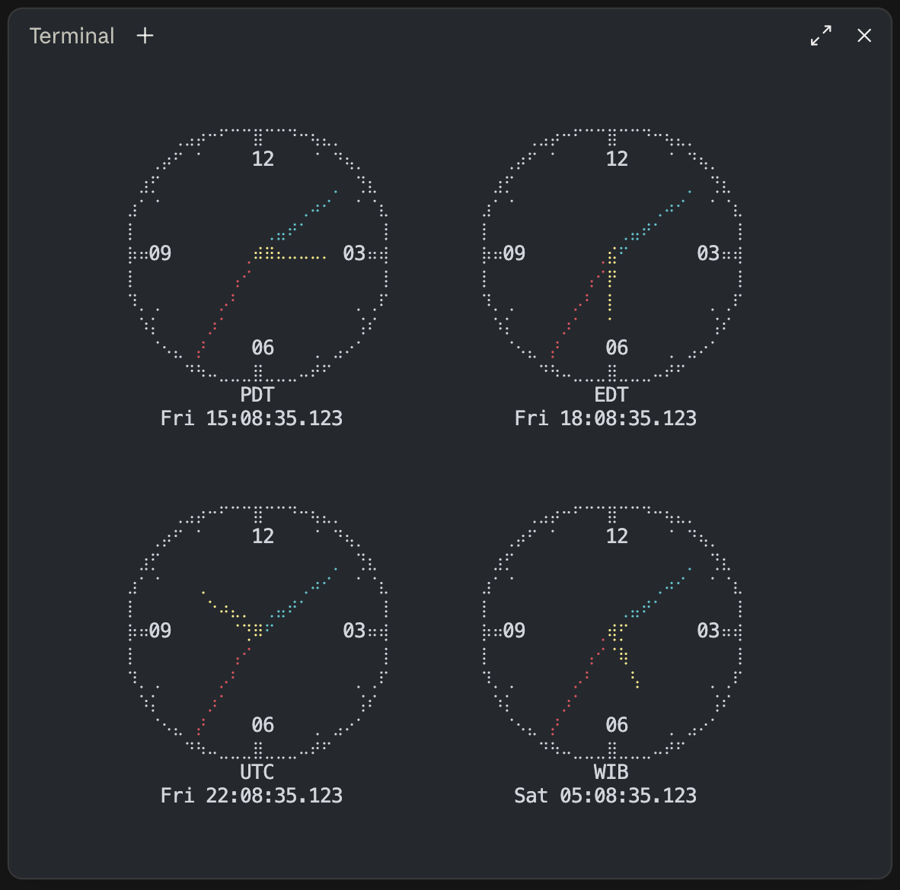

# clock

A terminal clock: one analog face per time zone, its name and digital readout
underneath, ordered by the time they read and spread over the window. Two
independent implementations — Python and Go — that render byte-for-byte
identical output.

```sh
./clock.py 10001,PT,Jakarta,UTC
```



On a terminal the hands are coloured apart — hour yellow, minute cyan, second
red.

## Running

```sh
python3 clock.py   # or: make run-py
go run .            # or: make run-go
```

Press space to hold the frame still, `h` or `?` for the key list, and `q` (or
Ctrl+C) to quit.

Go needs `go run .`, not `go run clock.go`: the three termios ioctl requests
are the one thing that differs between the BSDs and Linux, so they live in
build-tagged `term_*.go` files, and naming a single file skips them.

## Installation

Neither implementation has a third-party dependency. The Go side is standard
library only; the Python side needs nothing beyond `zoneinfo`, which has
shipped in the standard library since 3.9. The one thing either reaches outside
itself for is [`ziptz`](ziptz/), the ZIP-to-zone library in this repository —
also standard library only, and also here in both languages.

```sh
go build -o clock . && mv clock /usr/local/bin/
```

builds the binary and puts it wherever you like; `go install .` does the same
but drops it in `$GOPATH/bin` (or `$GOBIN`) under the name `clock`, which is
on `PATH` already if you use Go tools regularly. Both find `ziptz` through the
`replace` directive in `go.mod`, so a fresh clone builds without fetching
anything.

`clock.py` is executable on its own — it carries a `#!/usr/bin/env python3`
shebang — so the Python side needs no build step, only a copy of it and of
`ziptz.py` beside it:

```sh
cp clock.py ziptz/ziptz.py /usr/local/bin/
mv /usr/local/bin/clock.py /usr/local/bin/clock
```

or, to manage them like any other Python tool instead:

```sh
pip install ./ziptz .
```

which puts a `clock` entry point on your `PATH` inside whatever environment
you ran `pip` in — a virtualenv, or `pipx install ./ziptz .` for one isolated
from your other Python packages. `pip install -e ./ziptz -e .` does the same
but re-reads both files from this checkout on every run, for working on them in
place.

`ziptz` carries ZIP codes and nothing else, so the Python clock treats it as
optional: without it every zone name, abbreviation and country code still
works, and a ZIP code says what to install rather than the clock refusing to
start. A clone needs nothing installed either — `ziptz/` is a package, and
`clock.py` finds its own directory first — so `python3 clock.py 94110` works
straight out of a checkout.

## Usage

```
clock [-n N | --per-row N] [--color[=WHEN]] [--day[=WHEN]] [-q | --quiet]
      [--halign WHERE] [--valign WHERE] [--hpad SPACE] [--vpad SPACE]
      [--cell-ratio N] [--scale N] [ZONES]
```

With no arguments you get one clock, in your local zone. Otherwise `ZONES` is a
comma-separated list, and `-n` caps how many sit side by side before the grid
wraps to a new row. By default `-n` is `auto` too, alongside `--scale`: rather
than a fixed cap it picks whichever count grows the clocks the most, which
for a wide, short window can be more than the plain default (3) and for a
tall, narrow one can be fewer. Give it a number to cap it the old way instead.

Flags may go before or after the zone list — all four of these are the same
command:

```sh
clock ET,PT,UTC -n 2
clock -n 2 ET,PT,UTC
clock ET,PT,UTC --per-row 2
clock --per-row 2 ET,PT,UTC
```

### Layout

The clocks are centred in the window, across and down, and the space around
and between them is shared out evenly — so they sit in from the edges rather
than against them, and the grid re-settles as the window changes. With the
default `--scale auto` this usually has little to work with, since the
clocks have already grown to use most of it; see [Tuning](#tuning) for that.
It still decides the axis auto-scale didn't need to fill, and everything
below still applies in full at a fixed `--scale`.

| flag | takes | default |
|---|---|---|
| `--halign` | `left`, `center`, `right` | `center` |
| `--valign` | `top`, `center`, `bottom` | `center` |
| `--hpad` | `even`, or a share of the width, `10%` | `even` |
| `--vpad` | `even`, or a share of the height, `5%` | `even` |

An even fill counts the margins as gaps: three clocks make four spaces, two of
them against the edges, and each gets an equal share of what the faces leave
over. Sharing between the clocks alone would give every spare column to the
gutters and press the outer clocks flat against the borders — which is the one
arrangement nobody wants, and which no amount of guessing at a padding should
be needed to escape.

The share stops at the width of a face. Past that the clocks read as scattered
rather than as a group, so on a wide window the extra goes to the margins and
the clocks stay a cluster in the middle: at 300 columns two clocks sit 23
apart with 115 either side of them, not 254 apart in opposite corners. It never
goes below the packed 3 columns either, so a window just big enough for the
grid gets the packed layout rather than a squeeze.

Give a padding instead and the gap is that and nothing else, with everything
over going to the margins, so the alignment decides where the grid sits:

```sh
clock --hpad 5% ET,PT,UTC               # 5% of the window between clocks
clock --hpad 5% --halign left ET,PT,UTC # that grid, against the left edge
clock --vpad 0 --valign top ET,PT,UTC   # rows stacked at the top, touching
```

A percentage is a share of the whole window, not of what is left over: at 100
columns, `--hpad 10%` puts 10 columns between neighbours whatever else is on
screen, and unlike the even fill it is neither floored at 3 nor capped at a
face. The flags take their value either way round — `--hpad 5%` or
`--hpad=5%`.

An odd column cannot be halved into two margins — but a gutter can swallow it.
Where the even fill leaves an odd column over, one gutter is widened by one
instead, and the margins come out exactly equal: at 200 columns three clocks
sit 23 and 24 apart with 42 either side, dead centre. The widened gutter is
always the last of a full row, so a short row's clocks still line up with the
row above.

One clock has no gutter to put it in, so there the face itself sits a column
off centre; the readout under it then leans the other way, and that row comes
out level. A padding named with `--hpad` is left exactly as named — it is not
nudged to make the arithmetic work — so an odd column there goes to the right
margin, one column and no more. (A short last row is asymmetric on purpose:
its faces keep the gutters and margin of a full row rather than re-centring
themselves under it.)

Padding is not allowed to break the frame. The faces per row still drop to what
the width holds, counted against the padding you asked for rather than the
default 3 columns, and a `--vpad` that would push the grid past the last line
is refused the same way a too-tall grid always was.

A window that cannot be measured — redirected to a file, say — has nothing to
fill or centre, so it keeps the packed layout instead: three columns between
clocks, one row between rows, no margins.

### Order

Faces are laid out in the order their clocks read, earliest first — left to
right, then top to bottom — whatever order you typed them in. `clock
JST,PT,UTC` draws PDT, then UTC, then JST, and the grid reads chronologically:
each face is later than the one to its left, and the last face of a row is
earlier than the first of the next.

Sorting on the offset is the same thing. Every face renders one instant, so
what a clock reads is that instant plus its offset, and the westernmost zone is
the one furthest behind. Two faces on the *same* offset — `UTC` and `GMT` are
two faces, since they are labelled differently — keep the order you typed them
in. Like the merging, the sort is redone once a second as the clock runs, so a
zone entering daylight saving slides a place along as it happens.

### Different days

When the faces on screen do not all fall on the same date, every readout picks
up a weekday:

```
          PDT                       EDT                       UTC
   Tue 22:02:41.901          Wed 01:02:41.901          Wed 05:02:41.901
```

The weekday is absolute rather than a `-1d` counted from some reference face:
it is true on its own terms, and it does not change meaning when you reorder
the list. It appears under every face or none, so the columns stay lined up,
and only when there is a disagreement to point out — a row of clocks all
reading Wednesday says nothing worth three characters.

Nothing off screen is consulted. The clock compares the faces it draws against
each other and never asserts a date for a zone you did not ask for, so `clock
JST` on its own stays bare; name `local` alongside it to bring your own day
into the comparison.

Up to three dates can be on screen at once — UTC−12 to UTC+14 spans 26 hours,
which crosses two midnights — one reason the readout names the day outright
instead of counting days from somewhere.

`--day` overrides the rule: `--day` (or `--day=always`) puts a weekday under
every face whatever they read, `--no-day` (or `--day=never`) keeps it off
entirely, and `--day=auto` is the rule above, which is the default.

A pinned clock defaults to `always` instead. `CLOCK_FREEZE` makes a still of
one instant, usually to photograph, and an undated photograph records half of
it — so a pinned frame carries its date even when every face agrees.
`--day=auto` asks for the live rule back.

A face has to be 16 columns wide to hold `Wed 05:02:41.901`, which it is at any
`CLOCK_CELL_RATIO` from about 1.5 up. Below that the weekday is dropped rather
than the alignment, whatever `--day` says.

### Keys

| key | |
|---|---|
| space | hold the frame still, and again to carry on |
| `h` or `?` | show or hide the key list |
| `q` | quit, as does Ctrl+C |

`h` or `?` opens the key list in a bordered box centred over the clocks, the
same way a dialog sits over a window — not tucked under the grid, so it works
whatever the grid's size or alignment. In a window too small to hold the box,
the key press does nothing rather than clip or wrap it.

For the first three seconds a clock says `Press q or Ctrl+C to quit`, in that
same boxed style, then drops it — a clock that has taken the whole screen owes
you the way back out, but only until you have read it. `-q`/`--quiet` skips
this hint from the start, for a launch that doesn't blink; the key list is
still there on `h` or `?` regardless. Pressing `h`/`?` before the three
seconds are up shows the key list in its place, since the list already says
everything the hint does.

### Holding a frame

Space stops the clock where it stands; space again lets it go on. Nothing else
changes — the frame stays on screen, the window can still be resized, and `q`
still quits — so a screenshot taken while it is held catches a still face and a
readout that agrees with it, down to the millisecond. Left to run, the second
hand moves within a single screenshot's exposure and the milliseconds are a
blur.

Holding is the only way to keep a frame you can see: quitting restores the
screen underneath, exactly as `less` does, so the clocks are gone before you
can photograph them, and redirecting to a file keeps a frame but draws no
clocks.

For a frame you can reproduce exactly — the ones in this README, for instance —
pin the instant instead:

```sh
CLOCK_FREEZE=2026-07-15T05:02:41.901000Z clock UTC,10001,PT
```

The hands never move, space has nothing to hold back, and `h` and `q` work as
usual. Every readout carries its weekday, for the same reason a photograph
wants a date on it. Redirect that same command to a file and it draws the one
frame and exits, instead of staying up.

`CLOCK_FREEZE` pins the time, not the size: with the default `--scale auto`,
the same command still comes out a different size in a different window. Add
a fixed `--scale` too — `--scale 1` for these README frames — for a screenshot
that reproduces byte for byte regardless of what window it's taken in.

### Colour

The three hands are coloured apart — hour yellow, minute cyan, second red, in
the terminal's own palette rather than fixed RGB, so they follow whatever theme
it is wearing. The rim, the ticks and the numerals stay plain.

Colour is on for a terminal and off for a pipe or a file, so a redirected frame
stays plain text. `--color=always` keeps it when redirecting, and any of
`--no-color`, `--color=never`, `--color=off` or `NO_COLOR` in the environment
drops it everywhere — though an explicit `--color=always` outranks `NO_COLOR`,
since that is what asking for *always* means.

Bare `--color` means `--color=always` and never eats the following argument,
the same rule `ls` and `git` use: `clock --color ET` is a coloured Eastern
clock, while `clock --color always ET` is two zone lists and an error. The
value only ever follows an `=`.

Where two hands cross, the shorter one is on top — hour over minute over
second. A longer hand covers a shorter one along its whole length, while the
short one can only ever hide a slice of it, so drawn the other way round the
hour hand disappears under the minute hand for minutes at a time. The hour
hand is the one you most want to find at a glance, and it is the one with
nowhere to hide.

Because a braille cell carries eight dots and one colour, a crossing tints
whole cells: where the minute hand passes under the hour hand, the shared
cells go yellow, taking a few of the minute hand's dots with them. Numerals
win outright — a cell holding one drops its dots and its colour together.

## Zone names

Resolved in this order, first match winning:

| You type | You get | |
|---|---|---|
| `ET` `CT` `MT` `PT` | `America/New_York` and friends | follows daylight saving, so it reads `EST` in winter and `EDT` in summer |
| `AKT` `HT` `BST` `UK` `IST` `JST` `KST` `SGT` `HKT` `AET` `ACT` `AWT` `NZT` | the obvious place | same |
| `Europe/Berlin` `UTC` `EST` `MST` `HST` `GMT` `CET` `Etc/GMT+5` | itself | any name the tz database knows |
| `Berlin` `Jakarta` `New_York` `Indiana/Indianapolis` | the zone that ends in it | the city alone, where only one zone ends that way |
| `PST` `PDT` `EDT` `CST` `CDT` `MDT` `AKST` `AKDT` `HDT` | that exact offset | a fixed clock that never shifts |
| `JP` `GB` `DE` | that country's zone | 2-letter ISO code, via `zone.tab` |
| `94110` `941` | the zone that ZIP is in | US only |
| `local` | your system zone | |

### The city alone

An IANA name ends in the city, and the city on its own will do when only one
zone ends that way — `Berlin` for `Europe/Berlin`, `Jakarta` for
`Asia/Jakarta`. Case does not matter, and any whole tail of the name works, so
`Indianapolis` and `Indiana/Indianapolis` both reach
`America/Indiana/Indianapolis`.

Whole segments only: `York` is not `New_York`, and `Berl` is not `Berlin`.
Names come from `zone.tab`, the same file the country codes are read from,
which lists the canonical zones and leaves out the backward-compatibility
links — so `Eastern` is not a name here, while `US/Eastern` still resolves the
ordinary way, in full.

This is looked up last, after the tz database has had its say, so a city can
never shadow a name the database itself answers to.

Ambiguity is refused rather than guessed at:

```
$ clock Berlin
clock: Berlin names 2 zones; name one in full: Europe/Berlin, America/Berlin
```

Every city in the tz database is unique today — all 418 zones in `zone.tab`
end differently — but nothing promises it stays that way, and two clocks an
ocean apart is not a choice to make on your behalf.

The abbreviations only fill gaps the tz database leaves, which is why `EST` and
`ET` are different clocks and both are right: **`EST` is the fixed −05:00 zone
that never shifts**, while **`ET` is the eastern US, which does**. Same for
`MST` vs `MT` and `HST` vs `HT`. `GMT` and `CET` are likewise left alone —
aliasing `GMT` to `Europe/London` would make it read `BST` every July.

`PST`, `PDT`, `EDT` and the rest name an offset rather than a place — nowhere
is on `PDT` in January — so the tz database has nothing to look up. They become
fixed-offset clocks instead, which is exactly what the names mean. Put a pair
side by side in July and the difference shows:

```
$ clock PST,PT,PDT
          PST                     PDT/PT
     12:00:00.000              13:00:00.000
```

`PST` stays on −08:00 while `PT` has moved to `PDT` — and `PT` and `PDT`, being
the same clock in July, have merged into one face. In January they separate
again, with `PT` back on `PST`.

Two of these carry a judgement call. `CST` is the US Central reading, −06:00,
not China — for China use `CN` or `Asia/Shanghai`. And `HDT` is −09:00, the
Aleutian daylight zone, since Hawaii itself never leaves `HST`.

A country that genuinely spans zones asks you to pick:

```
$ clock US
clock: US spans 8 time zones; name one: America/New_York, America/Chicago, ...
```

Countries whose zones merely agree — Germany lists both `Europe/Berlin` and the
`Europe/Busingen` enclave — collapse to one and resolve without complaint.

### Duplicates

Two zones showing the same wall clock are one face, whatever you called them:
`PDT,PDT`, `UK,BST` and `ET,America/New_York` each draw once. The face is
labelled with the abbreviation, and when more than one spelling collapsed onto
it, with those spellings too — `UK,BST` reads `BST/UK`, while `PDT,PDT` was
never ambiguous and stays plain `PDT`.

Whether two zones agree is a property of the instant, not of the zones, so the
grouping is redone as the clock runs rather than fixed at startup. `PT` and
`PDT` are one face in July and two in January, and a clock left running across
the boundary splits itself as it happens — within a frame of the transition,
since the grouping is recomputed once a second, the coarsest interval that
cannot skip one.

### ZIP code accuracy

Give all five digits and the answer is exact. Three digits (the prefix alone)
is usually right but not always: 233 ZIP codes, across 30 prefixes, sit on the
losing side of a zone boundary their prefix rounds the wrong way.

```
$ clock 79835        # Canutillo, TX — El Paso County
   MDT               # right: five digits are always exact
$ clock 798          # the prefix alone
   CDT               # wrong: most of 798 is CDT, but not this ZIP
```

Verified against the source: of 33,791 ZIP codes, 233 (0.69%) resolve wrongly
from the prefix alone, and **none** resolve wrongly from all five digits.

The worst case a prefix gets wrong is `96799`, American Samoa, an hour behind
Honolulu; the mildest is `86502`, which resolves to Phoenix where its prefix
rounds to Denver — the same time all winter, an hour apart all summer, since
Arizona skips daylight saving and the Navajo Nation around it does not.

One gap remains: PO-box and single-building ZIPs have no delivery-area data to
place them precisely, so even given in full they fall back to their prefix's
answer. See [ARCHITECTURE.md](ARCHITECTURE.md#zip-resolution) for how the two
lookup tables are built and encoded, and [When to
regenerate](ziptz/README.md#when-to-regenerate) for when they need to be.

The tables and the two lookups over them are not part of the clock: they are
[`ziptz`](ziptz/), a library in this repository, in Go and in Python, usable
and installable on its own.

## Tuning

`--cell-ratio` is your font's cell height / width, and is the only knob that
decides whether the face is round. Braille dots are square at exactly 2; most
fonts sit near 2.1, which is the default. Raise it if the face looks squished,
lower it if it bulges sideways.

```sh
clock --cell-ratio 2.6
```

`CLOCK_CELL_RATIO` sets the same thing, for a terminal you'd rather configure
once than pass a flag to every time; `--cell-ratio` wins if both are set.

```sh
CLOCK_CELL_RATIO=2.6 python3 clock.py
```

`ROWS`/`rowsN` sets the face height in terminal rows; the width follows from
the cell ratio, as `floor(ROWS * CELL_RATIO + 0.5)` — 23 columns at the
defaults. A whole frame is then

```
width  = perRow * COLS + (perRow - 1) * GAP
height = rows * (ROWS + 2) + (rows - 1) * VGAP
```

so one clock is 23x13, three across is 75x13, four zones at `-n 2` is 49x27,
and five zones at `-n 2` is 49x41. `GAP` and `VGAP`, 3 and 1, are the least
space the layout will leave between clocks: that is the size a grid packs down
to, and what decides how many faces fit.

By default `--scale` is `auto`: rather than a fixed size with the window's
extra room spread out as padding, it picks the largest size that still fits
using nothing more than `--hpad`/`--vpad`'s own minimum gap — so growing the
window grows the clocks themselves, not the space around them. It re-solves
every frame, so resizing the window live resizes the clocks with it. Whichever
axis isn't the tight one still has room left over, and that's exactly what
[Layout](#layout)'s halign/valign/hpad/vpad describe — a wide window with one
short row of clocks, say, still centres them top-to-bottom.

It will give up a few rows of that maximum for a size where the 12/3/6/9
numerals sit flush against their tick marks rather than half a cell off —
visible on some terminals, depending on how they draw braille next to text.
A fixed `--scale` skips that check and gives exactly the size asked for.

`-n`'s own default, `auto`, is what actually lets that maximum be found:
against a wide, short window a narrow cap forces more rows of clocks than the
window needs, and each of those rows steals height the face could have used
instead, so `-n auto` searches per-row counts too rather than assuming the
plain default (3) is the right shape for whatever window it finds. Cap `-n`
to a number and `--scale auto` still maximises the face, just against
whatever fixed shape that cap leaves it.

Give `--scale` a number instead for a fixed size, unrelated to the window:
`--scale 2` is twice the plain default (11 rows), `--scale 0.5` is half. A
fixed size is what leaves the window's leftover room as padding, the way
[Layout](#layout) and the geometry above describe — and it is also where a
fixed `-n` stops being just a cap on `-n auto`'s search and starts deciding
the grid's shape outright, exactly as it always did.

```sh
clock --scale 1.5
clock --scale auto -n auto   # the defaults; only worth naming to be explicit
```

## Terminal requirements

macOS and Linux. Windows is not supported — it has no termios and no `select`
on stdin — and both implementations say so and exit rather than failing
obscurely; use WSL.

You need a font with braille coverage, and a window big enough for one face
(23 columns at `--scale 1`, the base unit `--scale`/`--cell-ratio` work
from). The clock measures the terminal every frame; by default that is what
`--scale auto`/`-n auto` size and shape the grid against, and with a fixed
`--per-row` it is quietly lowered to whatever fits instead, so a narrow
window rewraps rather than garbling.

When not even one face fits, or the grid is taller than the window, the clocks
give way to the reason:

```
2 rows of clocks need 27 lines and this terminal has 26;
raise --per-row, or name fewer zones
```

It stays there, folded to whatever width there is, until the window can hold
the clocks again — dragging a corner back is the fix, and quitting to read an
error on a screen that is about to be restored is no help to anyone. Note that
a too-tall grid is fixed by *raising* `--per-row`, the opposite of a too-narrow
one. `q` and Ctrl+C still work while it is up.

Redirected output has no window to drag, so there the same conditions are what
they always were: the message goes to stderr and the clock exits 1. When it
can't measure at all, e.g. piped to a file, it renders exactly what you asked
for.

Because the clock runs on the alternate screen, quitting restores whatever was
on screen before it and the last frame does not linger — the same as `less` or
`vim`. Redirect to a file to keep a frame, or hold one with space and
photograph it.

A `kill -9` skips the terminal restore and leaves echo off and the alternate
screen active; `stty sane` and `printf '\033[?1049l'` fix it.

## Development

See [ARCHITECTURE.md](ARCHITECTURE.md) for how the renderer itself works —
the braille canvas, the colour layering, the repaint strategy.

`tools/difftest.sh` proves the two implementations agree. It pins both to a
fixed instant with `CLOCK_FREEZE` (an instant like
`2026-07-15T09:53:07.123456Z`, which redirected draws exactly one frame and
exits, and on a terminal stays up) and to a fixed window with
`COLUMNS`/`LINES`, then compares stdout, stderr and exit status across
hundreds of argument lists, terminal sizes and cell ratios — including the
`--scale`/`-n auto` searches, at window shapes chosen to land on both odd and
even sizes. Colour is compared too, under `--color=always` — a redirected
clock is plain otherwise — including the instants where the hands cross and
the layering decides what shows. It also cross-compiles for Linux, macOS and
Windows, and diffs the generated tables out of the two `ziptz` files.

```sh
tools/difftest.sh -v
```

What none of that can see is a change that alters the picture in *both*
implementations — which is how every change is made, in one pass. So sixteen
frames are kept as bytes in `tools/golden/`, one of each kind of picture the
clock can draw, and compared after the two are compared with each other.
Shortening the second hand in both passes all 900 differential cases and fails
15 of the 16 goldens.

```sh
BLESS=1 tools/difftest.sh    # accept the new rendering, deliberately
```

The diff in the commit is the only review those get, so bless on purpose and
read it.

`CLOCK_FRAMES` makes a case a *sequence* rather than a frame: it draws that
many, stepping the pinned instant by `CLOCK_STEP` milliseconds each time — one
tick, 19ms, by default — and compares the whole run.

```sh
CLOCK_FREEZE=2026-11-01T05:59:59.900000Z CLOCK_FRAMES=21 clock ET,PT,EST,UTC
```

That covers what a single frame cannot show, and what nothing else in the
harness reaches: the second hand sweeping between whole seconds, the rewind
repainting over the frame before it, and the faces regrouping mid-run — the
one above steps across the US fall-back, where `ET` lands on the fixed `EST`
and the two faces become one. Since the grouping is cached on the instant's
whole second, a one-frame case can never outlive that cache; a sequence can.
Both variables need `CLOCK_FREEZE`, are refused if it is absent, and like it
are dev hooks kept out of `--help`.

`tools/keytest.py` covers what difftest cannot reach at all: the keys. Space,
`h`, `?` and `q` are read only from a terminal in cbreak mode, so nothing
redirected ever presses one — difftest compares the table the key list is
built from, not what pressing `h` does. Each implementation runs under a pty,
both get the same keys at the same points, and what they paint is compared.

```sh
tools/keytest.py -v
```

A clock repaints every 19ms whether or not anything changed, so the streams are
collapsed to their *distinct* frames first: how many repaints landed between
two keystrokes is the machine's speed, not the clock's behaviour. Pinned with
`CLOCK_FREEZE`, what is left is exactly the states the keys walked through —
`h` `q` ends on a frame with the key list still up, an unknown key paints
nothing new. Holding is checked on a live clock instead, where there is
something to hold: both must paint one readout over and over while held, and
many while running.

difftest also keeps everything the Python clock writes to stderr and, at the
end, checks that every message `clock.py` can raise turned up in it —
`tools/errcover.py`. A message nothing ever prints is a message nothing tests,
and it looks exactly like one nobody has broken yet. Two are exempt, with the
reason written down: both need a machine with no working tz database, and Go
will not give its up even then, falling back to the copy inside the binary.

That check is what turned up the clock's one Python-only behaviour going
untested: without `ziptz` installed, a ZIP token says what to install while
every zone name, abbreviation and country code still works. Two cases now run
`clock.py` from a directory where the library is not there to import.

`tools/fitfuzz.py` throws window sizes at both implementations and checks what
comes back fits in them: no line wider than the window, no more lines than it
has. That is the same blind spot the goldens cover, generatively — a grid that
overflows overflows in both implementations, agrees with itself, and matches no
golden because no golden has that size. It is seeded, so a failure repeats.

```sh
tools/fitfuzz.py 400
```

It found one on its first run, in both implementations: the readout under a
face is a fixed twelve characters, the layout measured only the face, and a
window narrow enough to shrink the face below twelve wrote the readout past
the right edge — where it wraps, and a wrapped line desynchronises the repaint
that `fit_per_row` exists to protect. A face's column is now the wider of the
face and its readout.

`tools/docnums.py` holds the prose to the tables. The documents quote figures
that come out of the data — 233 ZIPs across 30 prefixes, 157 range records, 34
zones folded onto 11 letters — and regenerating the tables would leave those
sentences quietly false, since they still read fine and nothing else reads
prose. It recomputes each from the shipped tables and checks the file says it.
Dropping one exception group makes four documents fail at once.

`.github/workflows/test.yml` runs all of that on push and pull request, on the
floor and the ceiling of what the project claims to support — Go 1.21 with
Python 3.9, and current versions of both. The floor is the one that matters:
`pyproject.toml` promises 3.9 and nothing but that job checks it.

It resizes the window too, which difftest cannot: that pins `COLUMNS`/`LINES`
for a run and never changes them, so the re-measure the clock does every frame
— the reason it does not trap `SIGWINCH` — went untested until now. The cases
drag the window smaller and larger, and at a fixed `--scale` drag it smaller
than the clocks can fit, which on a terminal complains and keeps measuring
where redirected output would have exited. A clock that measured once at
startup fails four of them.

`ziptz` has tests of its own, and holds its two libraries to one shared list
of cases in `ziptz/testdata/cases.json` — the same idea as the difftest, a
rung down. `make test` runs those and the difftest together.

```sh
make test
```

The ZIP tables are `ziptz`'s, not the clock's, and so is regenerating them:
see [Regenerating](ziptz/README.md#regenerating) and [When to
regenerate](ziptz/README.md#when-to-regenerate) there. `make regen` from here
runs it in place. The short version is almost never, and *not* for
daylight-saving changes — the tables store zone names, not offsets, so a rule
change arrives with an OS update and needs nothing here.

The data derives from US Census ZCTA Gazetteer centroids (a US Government
work, public domain) resolved through
[timezonefinder](https://github.com/jannikmi/timezonefinder), whose boundaries
come from timezone-boundary-builder (ODbL).
